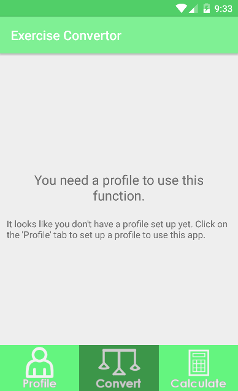
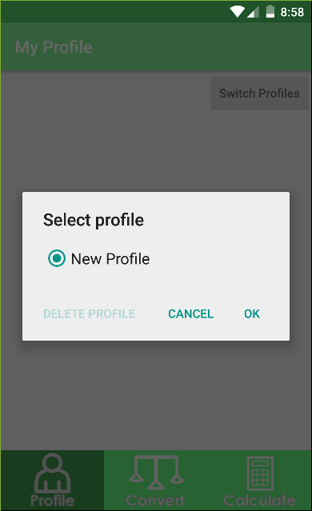
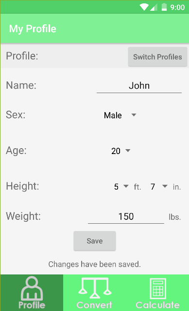
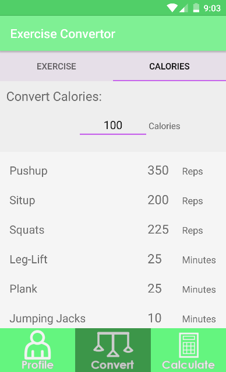
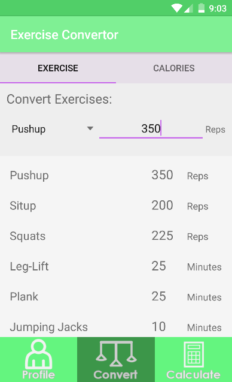
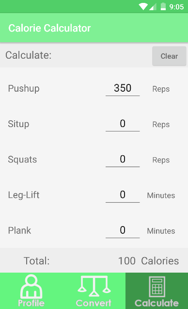
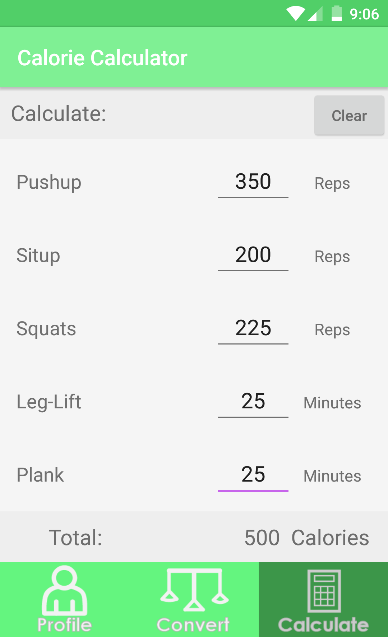

# PROG 01: Crunch Time

Calorie Monitor takes in user's physical information (ex. Age, Sex, etc.) and converts the amount of units from one exercise to the equivalent units of another exercise, calories to equivalent units of every exercise, vice versa, and totals the number of calories burned for multiple exercises based on the inputted information.

The apk is in the app/build/apk folder.

## Authors

Connie Truong ([ctruong1337@berkeley.edu](mailto:ctruong1337@berkeley.edu))

## Demo Video

See [Calorie Monitor Demo] (https://youtu.be/-UikWgvxOZk)

## Screenshots

## Acknowledgments

* The formula used to convert calories and conversion rates for rep-based exercises was derived from these sites:
* http://www.shapesense.com/fitness-exercise/calculators/activity-based-calorie-burn-calculator.aspx
* http://www.topendsports.com/testing/tests/home-pushup.htm
